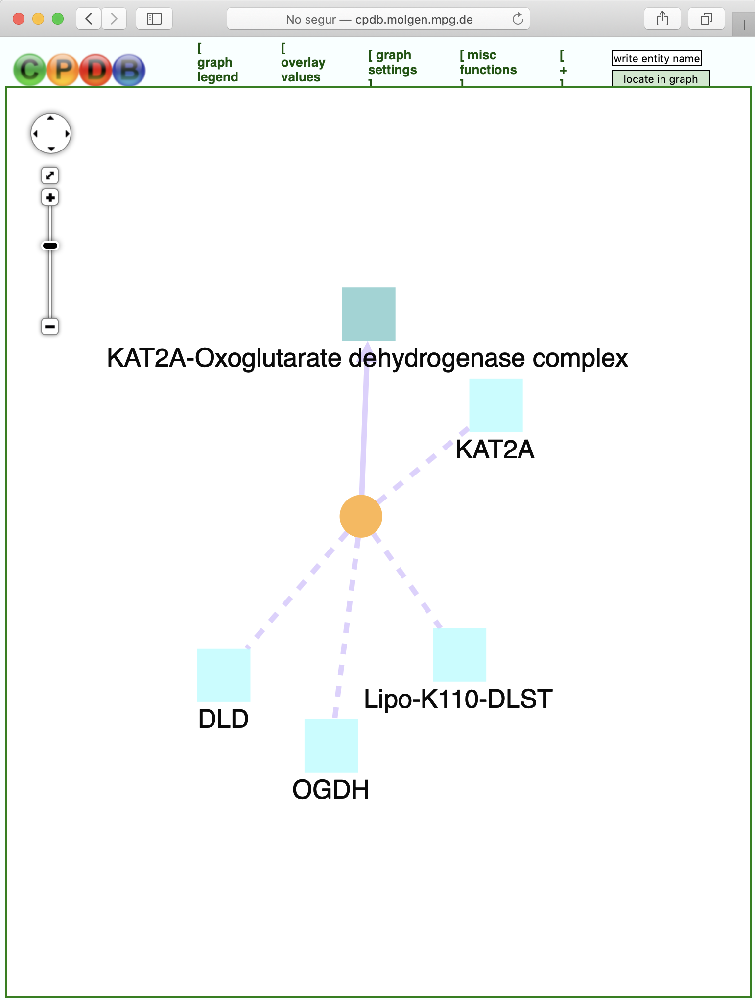
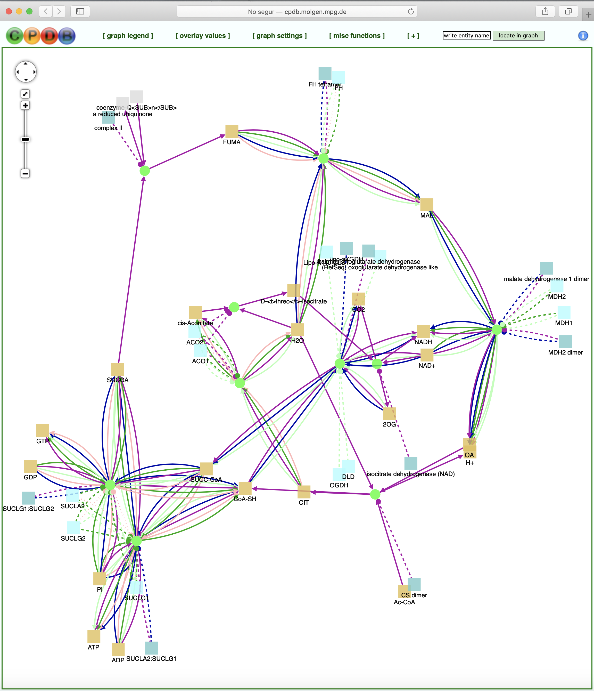
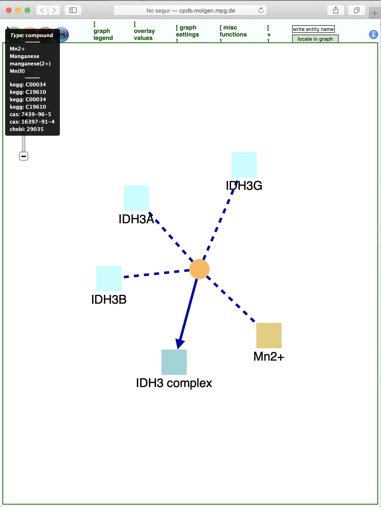

```{r setup_knitr, include=FALSE}
knitr::opts_chunk$set(message = FALSE, warning = FALSE,
                      cache=TRUE)
library(xml2)
library(dplyr)
library(RCurl)
library(stringr)
library(brgeEnrich)
library(DT)
library(knitr)
```

# Prerequisites

The package requires other packages to be installed. These include: `xml2`,`tidyverse`, `stringr` and `RCurl`, all available in CRAN.

# Getting started

To install the required packages input the following commands to the R console:

```{r installDependences, eval=FALSE}
# Install devtools
install.packages("devtools")

# Install required packages 
devtools::source_url("https://raw.githubusercontent.com/isglobal-brge/brgeEnrich/HEAD/installer.R")

# Install EASIER package
devtools::install_github("isglobal-brge/brgeEnrich@HEAD")
```

# ConsensusPathDB

ConsensusPathDB is a database that integrates different types of functional interactions between physical entities in the cell like genes, RNA, proteins, protein complexes and metabolites in order to assemble a more complete and a less biased picture of cellular biology. Currently, ConsensusPathDB contains metabolic and signaling reactions, physical protein interactions, genetic interactions, gene regulatory interactions and drug-target interactions in human, mouse and yeast. The interaction information is collected from 30 public resources and is integrated into a seamless network. Physical entities from the source databases are mapped to each other on the basis of common identifiers like UniProt and Entrez accession numbers. Interactions with matching primary participants (i.e., substrates and products in the case of biochemical reactions, interactors in the case of protein interactions and regulated gene in the case of gene regulatory interactions) are also mapped and grouped together according to similarity.
The database content is updated every three months with the newest available versions of the source databases; new source databases are integrated at the rate of 1-2 databases per release.

More information about ConsensusPathDB can be found in [ConsensusPathDB tutorial](http://cpdb.molgen.mpg.de/CPDB/tutorial)


## CPDB version

If we want to know with wich CPDB version of the source databases we are working with, we can use the function `getCpdbVersion`, 

```{r cpdbversion}
getCpdbVersion()
```


## Accession numbers types

ConsensusPathDB offers two statistical approaches to analyze user-specified lists of *genes* or *metabolites* for each list we can work with different accession numbers types, for example with genes we can work with accession numbers like *uniprot*, *hgnc-symbo*, *entrez-gene*, *ensembl*,...  and for metabolite list we can work with *kegg*, *hmdb* and others.
To know which accession number types for genes or metabolites we can use, we have the function `getCpdbAccessionTypes`.

```{r accessionNumbers}
# Accession number typtes for genes
getCpdbAccessionTypes('genes')

# Accession number typtes for metabolites
getCpdbAccessionTypes('metabolites')
```

## Functional set types

Depending if we are working with genes or metabolites we have distinc functional set types. The function `getCpdbAvailableFsetTypes` provides a list of available functional set types such as pathways, GO categories, NESTs, ... for genes or metabolites.

```{r FsetTypes}
# Functional set typtes for genes
getCpdbAvailableFsetTypes('genes')

# Functional set typtes for metabolites
getCpdbAvailableFsetTypes('metabolites')
```


## Map identifiers to ConsensusPathDB physical entities

With `mapCpdbAccessionNumbers` we can map the different ids from different data bases to a unique physical entity in ConsensusPathDB, to do that, we only need to define the different identifiers that we want to map and what type of identifier is it.
For example, if we want to map this *uniprot identifiers* : 
\  

'MDHM_HUMAN', 'MDHC_HUMAN', 'DLDH_HUMAN', 'DHSA_HUMAN', 'DHSB_HUMAN', 'C560_HUMAN', 'DHSD_HUMAN', 'ODO2_HUMAN', 'ODO1_HUMAN', 'CISY_HUMAN', 'ACON_HUMAN', 'IDH3A_HUMAN', 'IDH3B_HUMAN', 'IDH3G_HUMAN', 'SUCA_HUMAN', 'SUCB1_HUMAN', 'FUMH_HUMAN', 'OGDHL_HUMAN', 'ACOC_HUMAN', 'DHTK1_HUMAN', 'AMAC1_HUMAN'

to the ConsensusPathDB physical entity for **genes** we only have to do

```{r mapCPDBGenes}

# With Genes : 

# Uniprot idnetifiers
accNumbers <- c('MDHM_HUMAN', 'MDHC_HUMAN', 'DLDH_HUMAN', 'DHSA_HUMAN', 'DHSB_HUMAN', 'C560_HUMAN', 'DHSD_HUMAN', 'ODO2_HUMAN', 'ODO1_HUMAN', 'CISY_HUMAN', 'ACON_HUMAN', 'IDH3A_HUMAN', 'IDH3B_HUMAN', 'IDH3G_HUMAN', 'SUCA_HUMAN', 'SUCB1_HUMAN', 'FUMH_HUMAN', 'OGDHL_HUMAN', 'ACOC_HUMAN', 'DHTK1_HUMAN', 'AMAC1_HUMAN')

# Map uniprot identifiers to ConsensusPathDB physical entities
cpdbIds <- mapCpdbAccessionNumbers('uniprot', accNumbers)

cpdbIds

```

and if we want to map the **metabolies** ,
\  

'C00002', 'C00011', 'C00001', 'C00004', 'C00080', 'C00003', 'C00008', 'C00009', 'C00024', 'C00010', 'C00122', 'C00026', 'C00042', 'C00451', 'C00091', 'C00158', 'C00036', 'C00417', 'C00497'

from *kegg identifiers* : 


```{r mapCPDBMetabo}

# With Metabolites : 

# Kegg idnetifiers
accNumbersMetab <- c('C00002', 'C00011', 'C00001', 'C00004', 'C00080', 'C00003', 'C00008', 'C00009', 'C00024', 'C00010', 'C00122', 'C00026', 'C00042', 'C00451', 'C00091', 'C00158', 'C00036', 'C00417', 'C00497')

# Map kegg identifiers to ConsensusPathDB physical entities
cpdbIdsMeta <- mapCpdbAccessionNumbers('kegg', accNumbersMetab)

cpdbIdsMeta

```

## Get the CPDB background size

Function `getCpdbDefaultBackgroundSize` provides the default background size for over-representation analysis. The background size is the number of ConsensusPathDB entities that are anotated with an ID of the type the user has provided, and participate in at least one pathway / GO category / neighborhood-based entity set (depending on which of these predefined classes are considered by the user). 

If we want to get the default background size for *hgnc-symbol* in *protein complex-based sets* or *kegg in manually curated pathways from pathway databases*

```{r backgroundsize}
# genes : hgnc-symbol in protein complex-based sets
getCpdbDefaultBackgroundSize("C", "hgnc-symbol")

# metabolites : kegg in manually curated pathways from pathway databases
getCpdbDefaultBackgroundSize("P", "kegg")
```

## Over-representation analysis

The user can provide a list of identifiers of interesting genes or proteins, e.g. of genes that are significantly over- or underexpressed in a certain phenotype compared to a control phenotype. The gene identifiers are mapped to physical entities in ConsensusPathDB. Over-represented sets are searched among currently three categories of predefined gene sets: network neighborhood-based sets, pathway-based sets and Gene Ontology-based sets. For each of the predefined sets, a p-value is calculated according to the hypergeometric test based on the number of physical entities present in both the predefined set and user-specified list of physical entities. If no background is uploaded by the user (corresponding to the list of IDs of all measured entities in the experiment), the background parameter value for the hypergeometric test will depend on the type of the accession numbers used for the input list.

\ 

To perform the *over-representation analysis* we use the function `cpdbOverRepresentationAnalysis`, now, we perform an over-representation analysis from the gene accession numbers defined before in the mapping example. In this case, we only have to define if the analysis is for genes or metabolites, set types, in that case we perform the over-representation analysis for the protein complex-based sets  ('C'), the accNumbers and the type of this accNumbers.


```{r OverRepresentationAnalysis}

# Get Over-representation analysis for genes

accType <- 'uniprot'
overrep <- cpdbOverRepresentationAnalysis('genes', 'C',
                                          accNumbers, accType)

# Get results from 1 to 5
datatable(overrep[1:5,],
          caption = 'Over-Representation analysis for genes') 

```

Te function returns the name, the functiona set id, the CPDB link with the network representation, the p-value and q-value. If we want to see the Network representation we only have to go to the weg adress in CPDBurl column, for example, if we go to the CPDBurl adress for 'KAT2A-Oxoglutarate dehydrogenase complex', function set 1549908  we get

```{r cpdb_1549908, echo=FALSE, out.width='100%',  fig.align='center',  fig.cap="\\label{fig:Network plot for function set 1549908 in CPDB web}", fig.pos='ht'}
 
```


We can perform the over-representation analysis for metabolites too.

```{r OverRepresentationAnalysisMetabo}

# Get Over-representation analysis for metabolites

accTypeMeta <- 'kegg'
overrepMeta <- cpdbOverRepresentationAnalysis('metabolites', 'P',
                                          accNumbersMetab, accTypeMeta)

# Get results from 1 to 5
datatable(overrepMeta[1:5,],
          caption = 'Over-Representation analysis for metabolites') 

```

\ 

In that case, the network for the TCA cycle (HumanCyc)), filesetid 197155 is : 

\ 

```{r cpdb_metabo_OV, echo=FALSE, out.width='100%',  fig.align='center',  fig.cap="\\label{fig:Network plot for TCA cycle (HumanCyc) in CPDB web}", fig.pos='ht'}
 
```


## Enrichment analysis

The Wilcoxon enrichment analysis method carries out a paired Wilcoxon signed-rank test for each NEST / GO category / pathway based on the user-specified measurement values of its members. The measurement values for every gene / protein, uploaded by the user, typically reflect genome-wide gene expression or proteome-wide protein abundance in two different phenotypes. For every uploaded gene or protein, exactly two values must be supplied in the input form (or uploaded file). The Wilcoxon test assignes a P-value to each functional set based on how probable it is that the combined measurement differences of genes in the functional set between the phenotypes have appeared by chance. Q-values are calculated using the same method as in the over-representation analysis approach.

\ 

To perform the *enrichment analysis* we use the function `cpdbEnrichmentAnalysis`, now, we perform an enrichment analysis from the gene accession numbers used before, in that case, we also need to define two lists of mesured values or a unique list if we are working with fold change and we can also define the threshould .

```{r EnrichAnalysis}

# Get Enrichment analysis for genes
accType <- 'uniprot'

# Lists with mesured values mv1 and mv2 (simulation)
mv1 <- runif(length(accNumbers))
mv2 <- runif(length(accNumbers))

enrich <- cpdbEnrichmentAnalysis('genes', accNumbers, mv1, mv2, accType, 'C', 1 )

# Get results from 1 to 5
datatable(enrich[1:5,],
          caption = 'Enrichment analysis for genes') 

```


\ 

We can also get the graphical represetnation in the web using the url in column `CPDBurl`

\ 

```{r cpdb_gene_Enrich, echo=FALSE, out.width='100%',  fig.align='center',  fig.cap="\\label{fig:Network plot for IDH3 complex in CPDB web}", fig.pos='ht'}
 
```

\ 

We can apply the same procedure for metabolites to get the Wilcoxon enrichment analysis.

\ 


## CPDB entity ID in a functional set

To returns all CPDB entity IDs in a functional set we can use the function `getCpdbIdsInFset`. Note that functional sets of type 'N' (NESTs) are protected and cannot be retrieved.

For example, if we want to get all CPDB entity IDs in the functional set 1549908 corresponding to metabolites from the 'protein complex-based sets', type 'C', obtained in previous example, we can do :


```{r CpdbIdsInFset}
# CPDB entityIds in functional set 90664 from the manually curated pathways
getCpdbIdsInFset('1549908', 'C', 'genes' )

```

We get the CPDB entity IDs that belongs to the functional set 1549908


# Session info {.unnumbered}

```{r sessionInfo, echo=FALSE}
sessionInfo()
```
